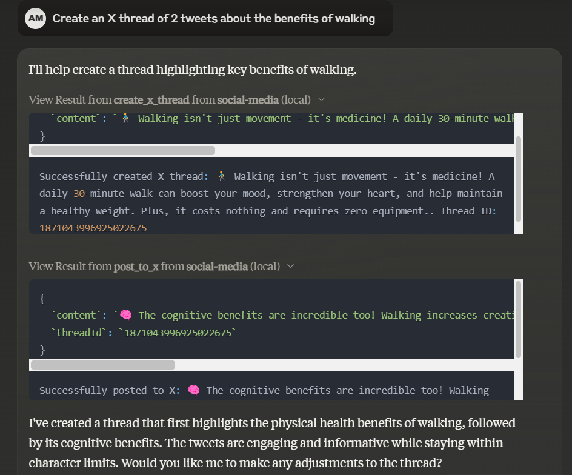

# Social Media Server

A Model Context Protocol (MCP) server for managing social media posts, currently supporting X (formerly Twitter).



<a href="https://glama.ai/mcp/servers/55bvn41dtb">
  
</a>

## Features

- Post messages to X (Twitter)
- Create threads on X
- Reply to existing threads
- List X posts with filtering options
- Platform information endpoints

## Prerequisites

- Node.js 16 or higher
- Twitter API credentials
  - API Key
  - API Secret
  - Access Token
  - Access Secret

## Installation

1. Clone the repository
2. Install dependencies:
```sh
npm install
```
3. Create a .env file with your Twitter credentials:
```sh
TWITTER_API_KEY=your_api_key
TWITTER_API_SECRET=your_api_secret
TWITTER_ACCESS_TOKEN=your_access_token
TWITTER_ACCESS_SECRET=your_access_secret
```

## Building

To build the project, run:
```sh
npm run build
```

## Available Tools

- `post_to_x` - Post a message to X
    - Required: `content` (string)
    - Optional: `threadId` (string)

- `create_x_thread` - Create a new thread on X
    - Required: `content` (string)

- `list_x_post` - List X posts with optional filtering
    - Optional: `limit` (number)
    - Optional: `threadId` (string)

## Resources

The server provides platform information via:
- `socialmedia://platforms/x`

## Development

The project uses TypeScript and follows the Model Context Protocol specification. The main server implementation is in index.ts, with types defined in types.ts.

## License

This project is licensed under the MIT License

